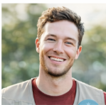

# Introdução

O Projeto Resgate é um projeto acadêmico criado por estudantes do Curso de Sistemas de Informação da Pontifícia Universidade Católica de Minas Gerais (PUC Minas). A proposta envolve a criação de uma plataforma online que, de maneira centralizada e acessível, liga organizações sociais a cidadãos voluntários em todo o país.

A plataforma tem como objetivo preencher uma lacuna identificada no ecossistema de voluntariado brasileiro: a falta de um canal digital unificado que simplifique tanto a divulgação de necessidades por instituições quanto a busca por oportunidades de engajamento por voluntários. Hoje em dia, essa comunicação é feita de maneira fragmentada, por meio de redes sociais, contatos informais e sites institucionais isolados. Isso diminui o impacto das ações e prolonga o tempo necessário para mobilizar os colaboradores.

A solução sugerida abrange dois perfis diferentes de usuários, voluntários e instituições, cada um com funcionalidades particulares para registro, administração de perfil, publicação e pesquisa de projetos. O desenvolvimento será feito utilizando tecnologias web atuais, focando na responsividade, proteção de dados e aderência à Lei Geral de Proteção de Dados (LGPD).

## Problema

A falta de uma plataforma centralizada e de fácil acesso para conectar voluntários a organizações sociais constitui um desafio considerável para o avanço de projetos de impacto social no Brasil. Hoje em dia, as instituições que procuram voluntários precisam usar vários canais de comunicação fragmentados, como redes sociais, e-mails, panfletos e indicações presenciais. Isso torna o processo mais demorado, caro e com alcance limitado.

De maneira semelhante, cidadãos interessados em voluntariado encontram desafios para encontrar oportunidades que se alinhem às suas habilidades, localização geográfica e disponibilidade de tempo. Essa desproporção na informação leva ao sub atendimento de projetos sociais, mesmo quando existe a possibilidade de envolvimento voluntário na sociedade.

A situação se torna mais grave em situações de crise, como desastres naturais, pandemias ou emergências humanitárias, quando a demanda por mobilização rápida é maior e a falta de um canal unificado dificulta a coordenação eficiente das ações.

O episódio das inundações em Juiz de Fora (2026) e o desafio do Instituto Butantan em angariar voluntários para os testes da ButanVac durante a pandemia de Covid-19 exemplificam de forma concreta os efeitos dessa falha.

Em resumo, a principal questão a ser resolvida é a falta de uma solução digital unificada que torne mais simples e centralize o processo de recrutamento de voluntários por organizações sociais, ao mesmo tempo que orienta e facilita a participação de cidadãos interessados em apoiar causas coletivas.

## Objetivos

O objetivo principal do Projeto Resgate é criar uma plataforma online que una de maneira eficaz e centralizada voluntários e organizações que executam projetos sociais, diminuindo as dificuldades na captação e engajamento de voluntários.

Os objetivos específicos são os seguintes:

●	Possibilitar o registro de voluntários e organizações sociais com perfis diferentes e personalizados;

●	Permitir que organizações publicam, administram e finalizar projetos sociais, detalhando as demandas de voluntários e os dados de contato;

●	Proporcionar ao voluntário uma interface para pesquisar e filtrar projetos, tornando mais fácil encontrar oportunidades que correspondam ao seu perfil;

●	Mostrar uma página com detalhes de cada projeto, incluindo informações completas sobre a causa, atividades planejadas e formas de contato com a instituição responsável;

●	Assegurar uma autenticação segura e a proteção das informações dos usuários em conformidade com a LGPD.

## Justificativa

Instituições e voluntários não tem uma forma fácil de se conectarem e o Projeto pretende facilitar essa conexão entre o projeto e o voluntário. Com a centralização da busca de voluntários em uma plataforma específica, instituições irão angariar voluntários de forma mais simplificada, adiantando trabalhos e beneficiando a sociedade.

A falta de voluntários já colocou em riscos projetos, uma matéria do site Acidade On, no ano da covid 19, o Instituto Butantan estava precisando de voluntários para dar andamento ao teste da vacina e não estava conseguindo ter voluntários para os testes.

Segundo o Jornal Data Folha de São Paulo (2021), há grande interesse dos brasileiros para o trabalho social, mas um dos principais motivos para o não engajamento é a falta de informação sobre essas atividades e meios para se engajar é um dos problemas que dificulta uma maior adesão aos serviços em projetos sociais.

Já segundo o site G1 (2018), o Brasil ainda tem que melhorar na área de responsabilidade social, pois tem vários projetos que precisam de colaboradores e esses projetos não evoluem ou não atendem mais pessoas por falta de pessoas.

O recente desastre das chuvas de Juiz de Fora, nos mostrou que temos uma falha em juntar as instituições que querem ajudar com as pessoas. Pois com as chuvas deste ano na cidade, apareceu várias empresas e/ou instituições para ajudar na cidade, mas foi o site Tribuna de Minas (2026) que juntou algumas dessas ações e colocou em seu site, para que o voluntário pudesse ver onde se enquadraria melhor com a sua ajuda e no site do Tribuna de Minas tinha o contato da instituição onde as pessoas poderiam pegar as informações para entrar em contato.

É justamente essa conexão que precisa ser feita de forma mais rápida, pois quando houver uma pessoa querendo ajudar outra ela consiga de uma forma mais rápida e ver quais instituições têm projeto e em que esse projeto está precisando de ajuda.

## Público-Alvo

O Projeto Resgate é voltado para dois grupos principais de usuários: as pessoas que criam os projetos sociais (independentemente se for pessoa física ou pessoa jurídica), para ajudar outras pessoas, ajudar com de atuação nas áreas como: saúde, educação, assistência social, meio ambiente, entre outras. E essa pessoa que cria o projeto social por necessidade ou pelo simples fato para ajudar as outras pessoas, quer pessoas que compartilhe com o objetivo do trabalho para que possa ir, gostar e voltar.

O voluntario é o cidadão de todas as idades, perfis socioeconômicos diversos que tem interesse de doar o seu tempo, o seu trabalho e seus conhecimentos a outras pessoas e que precisa ter uma maneira mais fácil de ver quais projetos sociais tem disponibilidade de vagas e do que se trata o projeto. Esse grupo abrange tanto pessoas com experiência anterior em voluntariado quanto aquelas que estão começando esse tipo de envolvimento.

De maneira secundária, a plataforma pode ser proveitosa para empresas que buscam incentivar o voluntariado entre seus funcionários, bem como para órgãos públicos e pesquisadores que desejam mapear projetos sociais em curso no país.

## Especificação do Projeto - Perfis de Usuário 

## Cidadão Voluntário
**Descrição:** 	
Pessoa física interessada em participar de ações sociais, mas enfrenta dificuldades em encontrar oportunidades de voluntariado compatíveis com seus interesses, localização e disponibilidade de tempo. 

**Necessidades:** 	
Pesquisar oportunidades de voluntariado
Filtrar projetos por localização, disponibilidade de tempo, tipo de atividade e interesses
Visualizar detalhes dos projetos (descrição, requisitos, datas e local)
Realizar inscrição nos projetos de forma prática
Entrar em contato com as instituições responsáveis
Acompanhar os projetos nos quais está vinculado

## Instituição voluntária
**Descrição:** 	
Pessoa responsável pela gestão de projetos sociais em uma organização (ONG, fundação ou associação comunitária), que necessita de um sistema para divulgar iniciativas e recrutar voluntários de forma eficiente

**Necessidades:**	
Cadastrar e editar projetos de voluntariado
Informar descrição, requisitos, datas, local e número de vagas
Publicar demandas específicas de voluntariado
Gerenciar inscrições de voluntários
Visualizar perfis dos candidatos
Fazer a aprovação
Entrar em contato com voluntários
Acompanhar a participação e o engajamento dos voluntários
Visualizar e atualizar o perfil institucional

## Persona - Cidadão:

Nome: Lucas Andrade
Idade: 23 anos
Localização: Belo Horizonte – MG
Ocupação: Estudante universitário e estagiário
**Descrição**
Lucas tem interesse em participar de ações sociais, principalmente relacionadas a meio ambiente e apoio a comunidades. Ele já tentou encontrar oportunidades, mas teve dificuldade por falta de informações claras e pela limitação de tempo

**Objetivos:**
Participar de projetos sociais
Contribuir com causas que se identifica
Encontrar oportunidades rápidas e próximas

**Dores / Frustrações:**
Não sabe onde encontrar projetos confiáveis
Informações incompletas ou desatualizadas
Falta de tempo para procurar oportunidades

**Comportamentos:**
Usa redes sociais diariamente, principalmente à noite
Pesquisa no Google, mas desiste quando o processo é complicado
Já demonstrou interesse em voluntariado, mas nunca participou

## Persona - Instituição:

Nome: Ana Paula Souza
Idade: 38 anos
Localização: Belo Horizonte – MG
Ocupação: Coordenadora de ONG

**Descrição**
Ana é responsável por organizar projetos sociais e recrutar voluntários. Ela enfrenta dificuldades para encontrar pessoas comprometidas e divulgar suas ações de forma eficiente.

**Objetivos:**
Recrutar voluntários rapidamente
Divulgar projetos com maior alcance
Organizar melhor os participantes

**Dores / Frustrações:**
Dificuldade em encontrar voluntários engajados
Falta de um sistema organizado
Alto índice de desistência

**Comportamentos:**
Usa WhatsApp e redes sociais para divulgação
Depende de indicações e contatos
Gasta muito tempo organizando voluntários manualmente

## Histórias de Usuário

| Eu como (QUEM) | Quero/Desejo (O QUE) | Para (PORQUE) |
|----------------|----------------------|---------------|
| Responsável por uma instituição | Encontrar voluntários | Para preencher vagas e garantir a participação de pessoas nos projetos sociais |
| Cidadão interessado em voluntariado | Me voluntariar em projetos | Para contribuir com causas sociais e encontrar oportunidades próximas à minha localização |
## Requisitos do Projeto
- Ser entregue em até 1 semana;
- Não gerar nenhum custo inicial para hospedagem.  

## Requisitos Funcionais: 
| ID | Descrição | Prioridade |
|----|----------|-----------|
| 0 | O sistema deve apresentar informações sobre o projeto ao usuário | Alta |
| 1 | O sistema deve permitir ao usuário visualizar e editar seu perfil | Alta |
| 2 | O sistema deve permitir à instituição visualizar e editar seu perfil | Alta |
| 3 | O sistema deve permitir o cadastro de usuários e instituições | Alta |
| 4 | O sistema deve permitir à instituição cadastrar, editar e excluir projetos de voluntariado | Alta |
| 5 | O sistema deve permitir ao usuário pesquisar projetos de voluntariado | Alta |
| 6 | O sistema deve permitir ao usuário visualizar detalhes dos projetos, incluindo descrição, requisitos e contato | Alta |
| 7 | O sistema deve permitir ao usuário se inscrever em projetos de voluntariado | Alta |
| 8 | O sistema deve permitir à instituição visualizar e gerenciar voluntários inscritos | Média |
| 9 | O sistema deve permitir a comunicação entre usuário e instituição | Média |
## Requisitos não funcionais

| ID | Descrição | Prioridade |
|----|----------|-----------|
| 0 | Proteção de dados (LGPD) | Alta |
| 1 | Autenticação segura (login, senha e verificação de identidade) | Alta |
| 2 | Sistema disponível 24 horas por dia (alta disponibilidade) | Média |
| 3 | Compatibilidade com dispositivos móveis e navegadores modernos | Alta |
| 4 | Acessibilidade para usuários com deficiência | Média |
| 5 | Suporte a múltiplos idiomas | Baixa |
| 6 | Envio de notificações por e-mail não críticas | Baixa |

## Referências Bibliográficas
A Cidade On, Falta de voluntários pode atrapalhar estudos da ButanVac. Araraquara, 2021.
Disponível em: https://www.acidadeon.com/acervo/araraquara/falta-de-voluntarios-pode-atrapalhar-estudos-da-butanvac/amp/. Acesso em: 21 de mar 2026.
Folha de São Paulo, Maioria tem interesse, mas poucos fazem trabalho voluntário. São Paulo,
2021. Disponivel em: https://www1.folha.uol.com.br/seminariosfolha/2021/12/maioria-tem-interesse-
mas-poucos-fazem-trabalho-voluntario-mostra-datafolha.shtml. Acesso em: 21 de mar 2026.
G1, Falta de voluntários limita evolução da responsabilidade social', diz fundadora da
Abraccia. Ribeirão Preto, 2018. Disponível em: https://g1.globo.com/sp/ribeirao-preto-
franca/noticia/2018/12/28/falta-de-voluntarios-limita-evolucao-da-responsabilidade-social-diz-
fundadora-da-abraccia.ghtml. Acesso em: 21 de mar 2026.
Tribuna de Minas, Precisa de ajuda ou quer ajudar? Veja iniciativas em Juiz de Fora que
prestam apoio para os atingidos pela chuva. 2026. Disponível em:
https://tribunademinas.com.br/noticias/cidade/26-02-2026/iniciativas-apoio-jf.html. Acesso em: 21 de
mar 2026.
